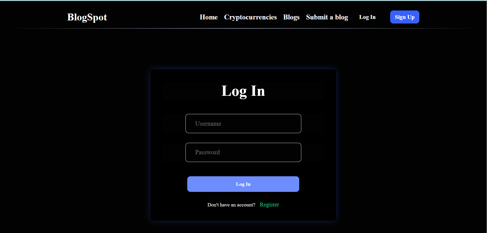

# Blog Spot

## Screenshots

### 1. Homepage

This is the homepage of Blog Spot, where users can explore various cryptographic-related blogs.


### 2. Cryptographic Blogs

This page displays a list of blogs specifically related to cryptography.


### 3. User Registration

New users can create an account using this signup page.


### 4. Login Page

Users can log in securely using their credentials.


### 5. Create a Blog

Authenticated users can create new blogs with a title, description, and images.


### 6. Blog Details

This page shows the details of a single blog post.


## Description

**Blog Spot** is a blog management system specifically designed for cryptographic-related blogs. It provides a secure platform for bloggers to publish, manage, and share their content.

## Technologies Used

- **Frontend:** React, Formik
- **Backend:** Node.js, Express.js
- **Database:** MongoDB with Mongoose ORM
- **Authentication:** JWT (JSON Web Token)
- **Security:** Password encryption
- **Cloud Storage:** Cloudinary (for storing images)
- **Validation:** Joi

## Installation

1. Clone the repository:

   ```bash
   git clone https://github.com/yourusername/blog-spot.git
   ```

2. Navigate to the project directory:

   ```bash
   cd blog-spot
   ```

3. Install dependencies:

   ```bash
   npm install
   ```

4. Configure environment variables:

   - Create a `.env` file in the root directory.
   - Add the following variables:

     ```env
     MONGO_URI=your_mongodb_connection_string
     JWT_SECRET=your_jwt_secret
     CLOUDINARY_CLOUD_NAME=your_cloudinary_cloud_name
     CLOUDINARY_API_KEY=your_cloudinary_api_key
     CLOUDINARY_API_SECRET=your_cloudinary_api_secret
     ```

5. Start the development server:

   ```bash
   npm start
   ```

## Usage

- Users can create an account and log in.
- Authors can write and manage cryptographic-related blogs.
- Blogs can include images stored securely on Cloudinary.
- Secure authentication using JWT.

## Contributing

Contributions are welcome! Feel free to fork the repository and submit a pull request.

## License

This project is licensed under the MIT License.
